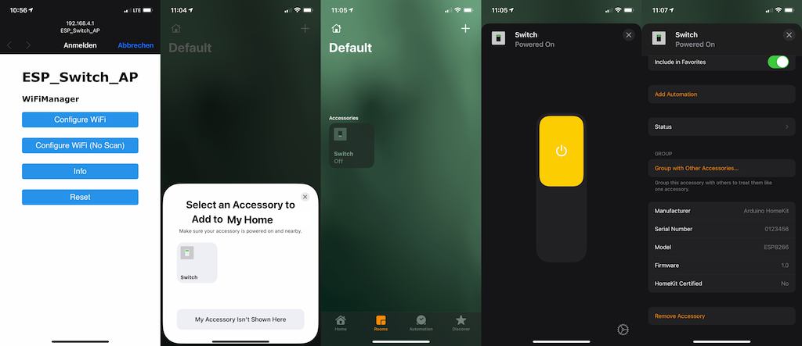
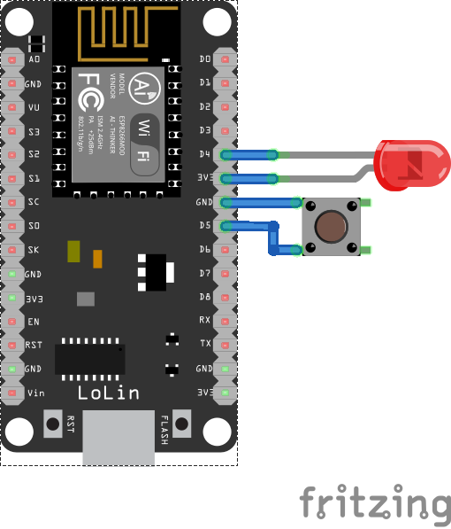

# ESP8266 Arduino HomeKit Switch <!-- omit in toc -->

<p>
  <a href="https://github.com/simongolms/device-bars/blob/master/LICENSE" target="_blank">
    
  </a>
  <a href="https://github.com/semantic-release/semantic-release" target="_blank">
    
  </a>
</p>

> Using an ESP8266 as a switch with native Apple HomeKit support

## Demo/Preview



## Start/Setup

### Initial

On the first startup, the ESP8266 creates an open access point with the name `ESP_Switch_AP`. Further functionalities are blocked at this time.

### Connect with your network

Connect to the public access point. A portal appears where you can search for existing Wifi networks and connect with them.
Once you have entered the credentials, the ESP8266 will restart and connect as a client to the selected Wifi network.
If a connection is not possible, e.g. due to wrong credentials or a timeout, the ESP8266 will restart as an access point again and the connection credentials can be re-entered.
At this point the output can now be toggled with the connected/flash button.

### Add to HomeKit

As soon as the ESP8266 is connected to the network, the `Home` app can be opened on the iOS device and be added as a new device.#

#### Paring Code

For the paring the following code has to be entered: `111-11-111`.

Alternatively, the following QR code can be scanned:


---

## Wiring



### Pins

| Label  | GPIO    | Property                                                  |
| ------ | ------- | --------------------------------------------------------- |
| **D4** | GPIO 2  | Output                                                    |
| **D5** | GPIO 14 | Input to toggle in parallel to the onboard `Flash` button |

---

## Workspace

### Local Development

#### Required

- Arduino v1.8.13
  - Additional Board Manager: `https://arduino.esp8266.com/stable/package_esp8266com_index.json`
    - esp8266 by ESP8266 Community v2.7.4: https://github.com/esp8266/Arduino
  - Libraries:
    - HomeKit-ESP8266 by Mixiaoxiao v1.2.0: `https://github.com/Mixiaoxiao/Arduino-HomeKit-ESP8266`
    - WifiManager by tzapu v0.16.0: `https://github.com/tzapu/WiFiManager`
- Python 3.9
  - pip `curl https://bootstrap.pypa.io/get-pip.py -o get-pip.py`
    - esptool v3.0 `pip install esptool`
    - pyserial v3.5: `pip install pyserial`

#### Optional

- VSCode
  - (Extension) Arduino v0.3.4: `https://github.com/Microsoft/vscode-arduino`
    - Update values of `inlcudePath` in `.vscode/arduino.json` to match you environment

### Further Configuration

#### In-/Output

The following definitions can be changed to modify the pins of the inputs and outputs.

_Keep in mind the basic properties of the pins, because not every pin can be used as input and output._

```c
// switch.ino
#define PIN_BUTTON 14 // D5 Button
```

```c
// accessory.c
#define PIN_SWITCH 2 // D4 Output to trigger on/off
```

#### Additional Inputs

```diff
// switch.ino
void homekit_setup() {
  accessory_init();

  pinMode(PIN_BUTTON, INPUT_PULLUP);
  pinMode(PIN_BUTTON_FLASH, INPUT_PULLUP);
+ pinMode(PIN_BUTTON_DX, INPUT_PULLUP);

  ESPButton.add(0, PIN_BUTTON, LOW, true, true);
  ESPButton.add(1, PIN_BUTTON_FLASH, LOW, true, true);
+ ESPButton.add(2, PIN_BUTTON_DX, LOW, true, true);

    ...
}
```

#### Paring Code

Change the property `.password` to use a different paring code

```diff
// accessory.c
homekit_server_config_t config = {
    .accessories = accessories,
-    .password = "111-11-111",
+    .password = "123-45-678",
    .setupId = "ABCD"
};
```

To create a new QR Code the following page can be used: https://github.com/maximkulkin/esp-homekit/tree/master#qr-code-pairing

**Requirements:**

- Python 3.9
  - pip: `curl https://bootstrap.pypa.io/get-pip.py -o get-pip.py`
    - qrcode v6.1: `pip install qrcode`

If the [accessory category](https://github.com/maximkulkin/esp-homekit/blob/379f593baad364c90233587a96241f636719d103/include/homekit/types.h#L49) is still a switch, the following terminal command can be entered to execute the Python script and create a new QR code:

```sh
# tools/gen_qrcode <accessory category code> <password> <setup id> <output filename>
tools/gen_qrcode 8 123-45-678 ABCD qrcode.png
```

### Verify & Upload

Select the appropriate port (e.g. `/dev/tty.usbserial-1234`) and Baud Rate `115200` and start the verification and upload in the `switch.ino` file in VSCode

## Author

**Simon Golms**

- Digital Card: `npx simongolms`
- Github: [@SimonGolms](https://github.com/SimonGolms)
- Website: [gol.ms](https://gol.ms)

## Contributing

Contributions, issues and feature requests are welcome!<br />Feel free to check [issues page](https://github.com/simongolms/arduino-homekit-esp8266-switch/issues).

## Show Your Support

Give a ⭐️ if this project helped you!

## License

Copyright © 2020 [Simon Golms](https://github.com/SimonGolms).<br />
This project is [MIT](https://github.com/simongolms/arduino-homekit-esp8266-switch/blob/master/LICENSE) licensed.

## Resources

- [Arduino Board - ESP8266](https://www.esp8266.com/)
- [Arduino Library - Arduino-HomeKit-ESP8266](https://github.com/Mixiaoxiao/Arduino-HomeKit-ESP8266)
- [Arduino Library - WiFiManager](https://github.com/tzapu/WiFiManager)
- [VSCode - Arduino](https://github.com/microsoft/vscode-arduino)
